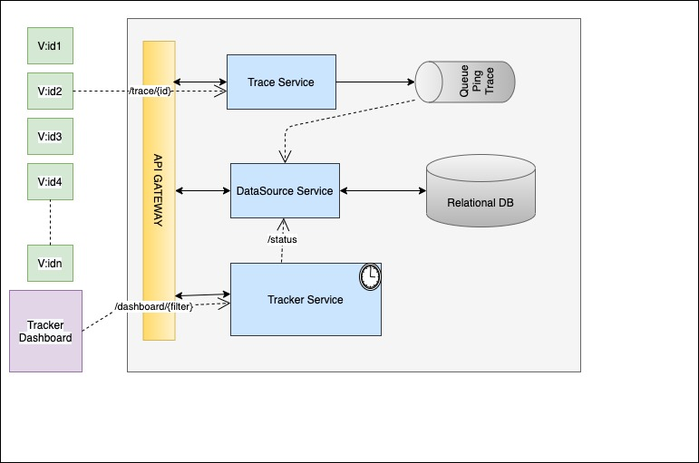

#Introduction

This project will give the tracing of vehicle with the help of Dashboard

#Architecture



#Application setup

Step : 1

``` git clone https://github.com/rhsbalaram/ETEK.git```

``` cd ETEK```

``` mvn clean install ```

Step : 2

Install : Docker, Docker-compose, minikube

Step : 3

We need to point local docker for images.
run ```minikube config set driver docker```
run ```minikube config set memory 10240MB```
  
run ``` minikube start ```

run ``` eval $(minikube -p minikube docker-env) ```

run ``` docker-compose build --no-cache ```

press ``` ctrl + c/z```exit after images got created.

run ```kubectl apply -f k8s```

run ```kubectl get pods --watch```

run ```minikube service api-gateway --url```

Get the url and access the application :)
url /tracker


